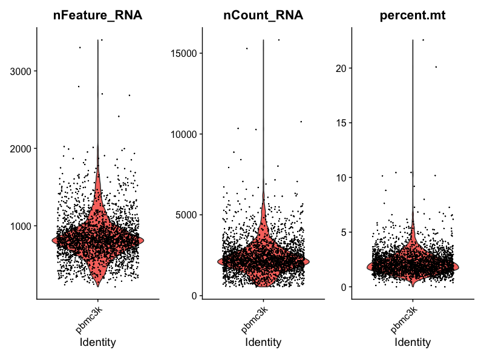
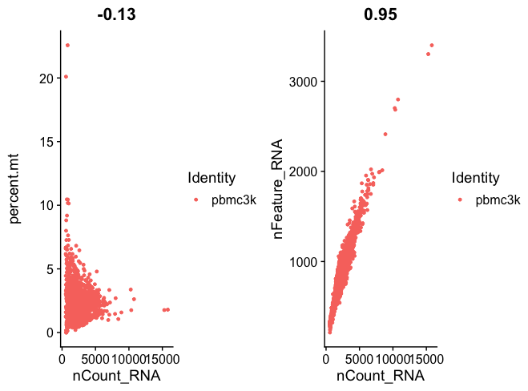
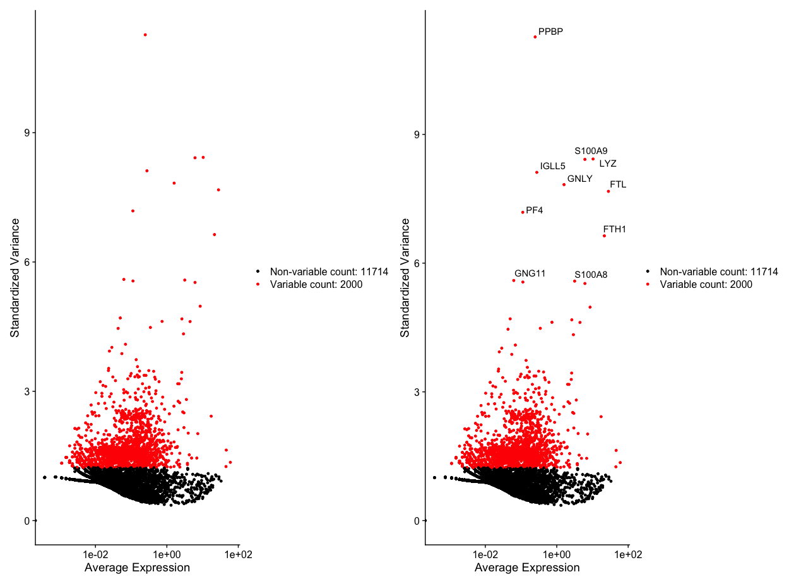
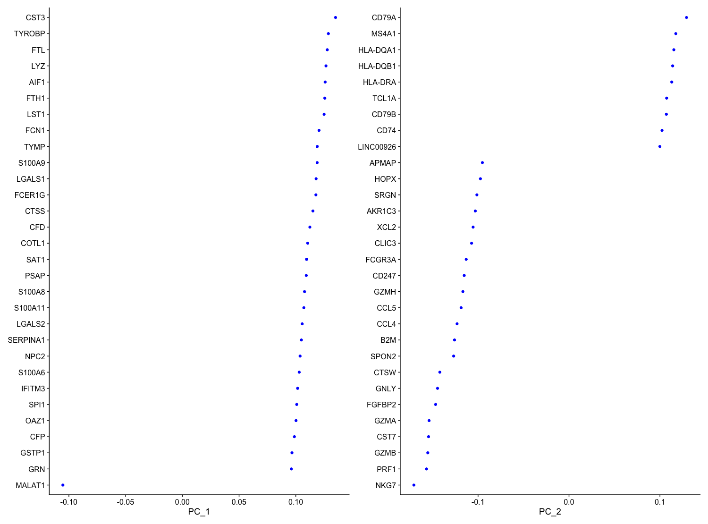

# scRNA_fundamental

## Step 1: Install the necessary packages

Lists of packages I used in this episode.

```r
rm(list = ls())

if (!require("BiocManager", quietly = TRUE))
  install.packages("BiocManager")

BiocManager::install("multtest")
BiocManager::install("Seurat")
BiocManager::install("SeuratData")
BiocManager::install("dplyr")
BiocManager::install("mindr")
BiocManager::install("tidyverse")
BiocManager::install("remotes")
BiocManager::install("R.utils")
remotes::install_github('satijalab/seurat-data')

library(multtest)
library(Seurat)
library(dplyr)
library(mindr)
library(tidyverse)
library(SeuratData)
library(ggplot2)
library(patchwork)
library(R.utils)
```

10x genomics have many samples to practice, we chose Peripheral Blood Mononuclear Cells (PBMCs).

```r
download.file('https://cf.10xgenomics.com/samples/cell/pbmc3k/pbmc3k_filtered_gene_bc_matrices.tar.gz','pbmc3k.gz')
untar(gunzip("pbmc3k.gz"))
```

## Step 2 Download sample data or local data#

### Peripheral Blood Mononuclear Cells (PBMCs) —— 外周血单个核细胞
```r
### We try the custom way, Local 10x data##

pbmc3k.data <- Read10X(data.dir = "./filtered_gene_bc_matrices/hg19/")
pbmc3k <- CreateSeuratObject(counts = pbmc3k.data, project = "pbmc3k", min.cells = 3, min.features = 200)

### min.cells = how many cell types a gene is expressed in at least, min.features = how many genes a cell expresses at least. Only when the conditions are met will the gene be retained

### Have a glimpse
pbmc3k

###An object of class Seurat 
###13714 features across 2700 samples within 1 assay 
###Active assay: RNA (13714 features, 0 variable features)
###1 layer present: counts

ncol(pbmc3k)
### 2700

ncol(pbmc3k.data)
### 2700

pbmc3k_express_matrix <- as.data.frame(GetAssayData(pbmc3k[["RNA"]], slot = "counts"))
### saving the matrix

write.table(pbmc3k_express_matrix,'testcount.txt', sep = '\t')
### write into the 'txt' file, but wasting space

pbmc3k[["percent.mt"]] <- PercentageFeatureSet(pbmc3k, pattern = "^MT-")
### Lowercase "mt" for mouse, Uppercase "MT" for human

head(pbmc3k@meta.data,5)

###                 orig.ident nCount_RNA nFeature_RNA
###AAACATACAACCAC-1     pbmc3k       2419          779
###AAACATTGAGCTAC-1     pbmc3k       4903         1352
###AAACATTGATCAGC-1     pbmc3k       3147         1129
###AAACCGTGCTTCCG-1     pbmc3k       2639          960
###AAACCGTGTATGCG-1     pbmc3k        980          521
```

```r
VlnPlot(pbmc3k, features = c('nFeature_RNA',"nCount_RNA","percent.mt"), ncol = 3)
### Normally before VlnPlot, you should run "NormalzeData()" firstly...
```


```r
plot1 <- FeatureScatter(pbmc3k, feature1 = "nCount_RNA", feature2 = "percent.mt")
plot2 <- FeatureScatter(pbmc3k, feature1 = "nCount_RNA", feature2 = "nFeature_RNA")
CombinePlots
```


```r
pbmc3k <- subset (pbmc3k, subset = nFeature_RNA > 200 & nFeature_RNA < 2500 & percent.mt < 5)
### 单细胞基因太少可能质量较差，测序深度或者细胞活性差；细胞基因数量过多可能是双细胞多细胞混合体，并没有形成单细胞悬液

ncol(pbmc3k)
### 2638
### Checking the results after filtering
```


## Step 3 Normalization
```r
pbmc3k <- NormalizeData(pbmc3k, normalization.method = "LogNormalize", scale.factor = 2000)
### Like TPM for normal RNA-seq, Eliminate the influence of sequencing depth (library size) on the 
### expression level between cells to make the expression levels of different cells comparable.
```

## Step 4 Find variable genes
```r
pbmc3k <- FindVariableFeatures(pbmc3k, selection.method = "vst", nfeatures = 2000)
top10_pbmc3k <- head(VariableFeatures(pbmc3k), 10)
```

```r
### Visualization variable genes
plot1 <- VariableFeaturePlot(pbmc3k)
plot2 <- LabelPoints(plot = plot1, points = top10_pbmc3k, repel = TRUE)
plot1 + plot2
```


### Optional Step: Scaledata

```
### The Scaledata() is the standardization of each gene in all cells prevents errors caused by overly outlier expression of a certain gene during the subsequent cell clustering process.
pbmc3k <- ScaleData(pbmc3k, features = rownames(pbmc3k)) ### all
pbmc3k <- ScaleData(pbmc3k) ### 高变基因
```

## Step 5 PCA dimension reduction

```r
pbmc3k <- RunPCA(pbmc3k, features = VariableFeatures(object = pbmc3k))
print(pbmc3k[["pca"]],dims = 1:5, nfeatures = 5)
###PC_ 1 
###Positive:  CST3, TYROBP, FTL, LYZ, AIF1 
###Negative:  MALAT1, LTB, IL32, IL7R, B2M 
###PC_ 2 
###Positive:  CD79A, MS4A1, HLA-DQA1, HLA-DQB1, HLA-DRA 
###Negative:  NKG7, PRF1, GZMB, CST7, GZMA 
###PC_ 3 
###Positive:  CD74, HLA-DPA1, HLA-DPB1, HLA-DQA1, CD79B 
###Negative:  PPBP, PF4, SDPR, NRGN, GNG11 
###PC_ 4 
###Positive:  HLA-DQA1, CD79B, CD74, CD79A, HLA-DPB1 
###Negative:  IL7R, VIM, IL32, GIMAP7, S100A6 
###PC_ 5 
###Positive:  MS4A7, CKB, FCGR3A, RP11-290F20.3, RHOC 
###Negative:  S100A8, S100A9, LGALS2, CD14, MS4A6A 

VizDimLoadings(pbmc3k, dims = 1:2, reduction = "pca")
```


```r
DimPlot(pbmc3k, reduction = "pca")
DimHeatmap(pbmc3k, dims = 1 , cells = 500, balanced = TRUE)
DimHeatmap(pbmc3k, dims = 1:15, cells = 500, balanced = TRUE)
```

## Step 6 Perform "hypothesis tests" on each principal component of PCA to generate P-values
```r
pbmc3k <- JackStraw(pbmc3k, num.replicate = 100)
pbmc3k <- ScoreJackStraw(pbmc3k, dims = 1:20)
JackStrawPlot(pbmc3k, dims = 1:20)
ElbowPlot(pbmc3k)
### 发现维度10左右就稳定了
```

## Step 7 Find neighbors
```r
pbmc3k <- FindNeighbors(pbmc3k, dims = 1:10) 
pbmc3k <- FindClusters(pbmc3k, resolution = 0.5)
```r
### 寻找近邻和集群，resolution 0.4-1.2，越大细胞cluster越多。

pbmc3k <- RunUMAP(pbmc3k, dims = 1:10)  
DimPlot(pbmc3k, reduction = "umap")
### UMAP降维


pbmc3k <- RunTSNE(pbmc3k, dims = 1:10)
DimPlot(pbmc3k, reduction = "tsne")
### T-SNE降维,更复杂，分类更好，适合小数据

cluster5.markers <- FindMarkers(pbmc3k, ident.1 = 5, ident.2 = c(0,3), min.pct = 0.25)
### 计算所有细胞

pbmc3k.markers <- FindAllMarkers(pbmc3k, only.pos = TRUE, min.pct = 0.25, logfc.threshold = 0.25)
### 寻找所有markergene
pbmc3k.markers %>% group_by(cluster) %>% top_n(n = 2, wt = avg_log2FC)
#### A tibble: 18 × 7
#### Groups:   cluster [9]
#       p_val avg_log2FC pct.1 pct.2 p_val_adj cluster gene     
#       <dbl>      <dbl> <dbl> <dbl>     <dbl> <fct>   <chr>    
# 1 7.21e-101       2.53 0.474 0.103 9.89e- 97 0       CCR7     
# 2 6.13e- 33       2.32 0.258 0.083 8.41e- 29 0       LDLRAP1  
# 3 0               6.65 0.969 0.121 0         1       S100A8   
# 4 1.85e-137       7.09 0.297 0.004 2.54e-133 1       FOLR3    
# 5 1.80e- 60       2.21 0.424 0.112 2.48e- 56 2       AQP3     
# 6 3.88e- 41       2.08 0.279 0.067 5.32e- 37 2       CD40LG   
# 7 2.40e-272       7.32 0.564 0.009 3.29e-268 3       LINC00926
# 8 2.75e-237       7.06 0.488 0.007 3.76e-233 3       VPREB3   
# 9 1.55e-175       4.63 0.569 0.05  2.13e-171 4       GZMK     
#10 5.95e- 79       3.61 0.387 0.061 8.17e- 75 4       GZMH     
#11 1.81e-197       6.15 0.968 0.13  2.48e-193 5       GNLY     
#12 3.02e-171       6.12 0.459 0.013 4.14e-167 5       AKR1C3   
#13 5.93e-220       5.60 0.522 0.01  8.14e-216 6       CDKN1C   
#14 6.13e-180       6.11 0.389 0.004 8.41e-176 6       CKB      
#15 9.14e-231       7.69 0.818 0.011 1.25e-226 7       FCER1A   
#16 3.35e-201       7.83 0.485 0.002 4.59e-197 7       SERPINF1 
#17 0              12.1  0.615 0     0         8       LY6G6F   
#18 4.07e-228      12.2  0.462 0     5.58e-224 8       CLDN5    

### 按照计算出的高表达的markergene传递给管道符号，选出表达量top n的基因
FeaturePlot(pbmc3k, features = c("MS4A1", "GNLY", "CD3E", "CD14", "FCER1A", "FCGR3A", "LYZ"))

top10 <-pbmc3k.markers %>% group_by(cluster) %>% top_n(n = 10, wt = avg_log2FC)
DoHeatmap(pbmc3k, features = top10$gene) + NoLegend()
### 用来参考细胞高表达基因的网络

new.cluster.ids <- c("Naive CD4 T", "CD14+ Mono", "Memory CD4 T", "B", "CD8 T", "FCGR3A+ Mono",
                     "NK", "DC","Platelet")
### id 重命名

names(new.cluster.ids) <- levels(pbmc3k)
pbmc3k <- RenameIdents(pbmc3k, new.cluster.ids)
DimPlot(pbmc3k, reduction = "umap", label = TRUE, pt.size = 0.5) + NoLegend()

sessionInfo()
### 环境确认，可以用

### 用RDS二进制文件保存，节省空间
```
